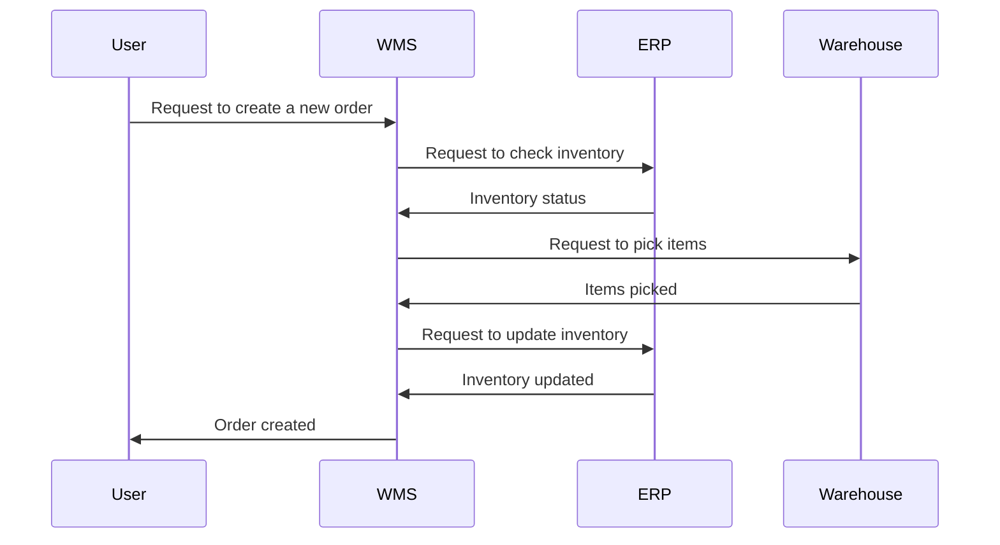
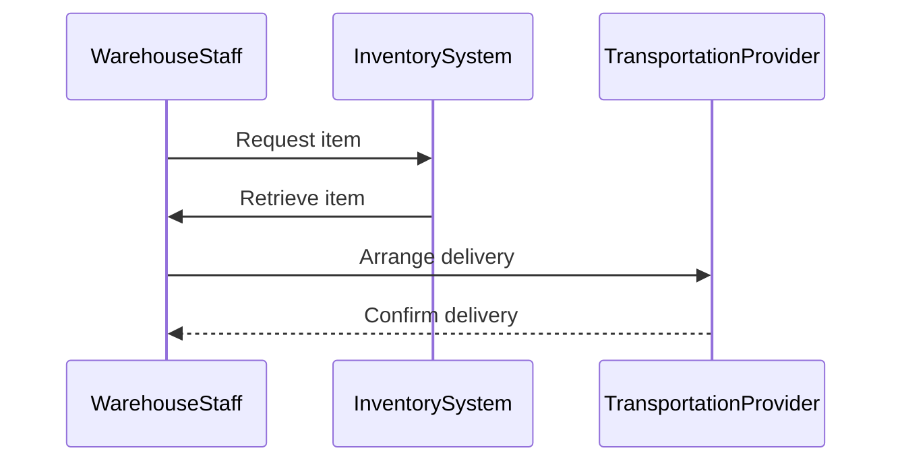
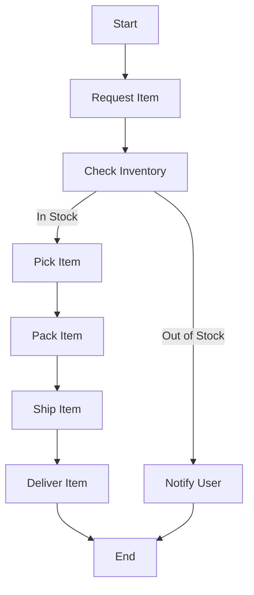
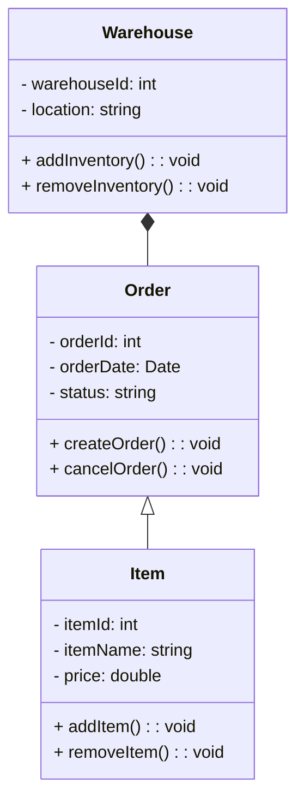

# Example of diagrams in mermaid.js using WMS (Warehouse Management System) as case study

## Sequence Diagram

- Diagram for creating a new order in a Warehouse Management System (WMS):

In this sequence diagram, the User initiates the process by requesting to create a new order in the WMS. The WMS then communicates with the ERP system to check inventory status, requests the Warehouse to pick items, updates inventory in the ERP system, and finally notifies the User that the order has been created.

- Diagram for requesting an item from the warehouse:

In this sequence diagram, WarehouseStaff initiates the process by requesting an item from the InventorySystem. Once the item is retrieved, WarehouseStaff arranges delivery with the TransportationProvider, who confirms the delivery upon completion.

## Flowchart

This flowchart illustrates the process of requesting an item from the warehouse. It starts with the User requesting an item, checking inventory status, picking the item if it's in stock, packing, shipping, and delivering the item. If the item is out of stock, the User is notified, and the process ends.

## Class Diagram

This class diagram represents the relationships between the Order, Item, and Warehouse classes in a Warehouse Management System. An Order can have multiple Items, and a Warehouse can have multiple Orders. The classes have attributes and methods related to their functionalities within the system.

## Conclusion

In conclusion, mermaid.js provides a versatile and user-friendly way to create various types of diagrams, such as sequence diagrams, flowcharts, and class diagrams. By using simple text-based syntax, developers can easily visualize and communicate complex processes and systems in a clear and concise manner. This tool can greatly enhance the documentation and understanding of software systems, making it an invaluable asset for developers.
